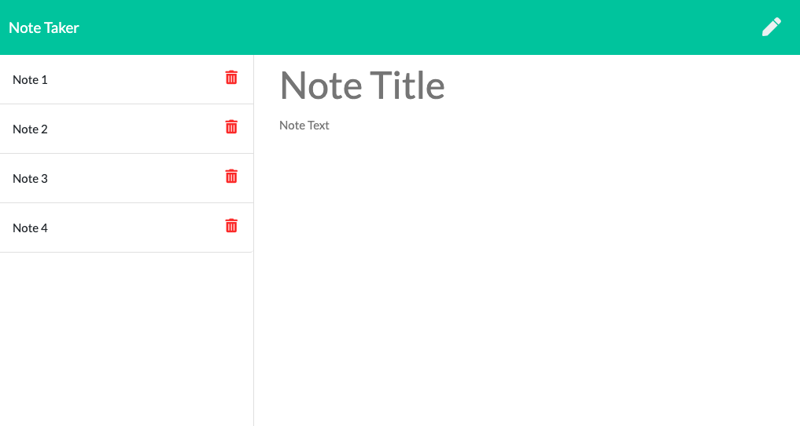

#  Note Taker
This application allows the user to enter a title and information into a note. When they click the save button, the note will be saved on the left column. 
When the user closes the browser and returns to the note app, the saved notes will still be there. When they are done with their notes, they can hit the trashcan button which deletes it from the server.

## Application Image

## Github Link 
[Github Repo](https://github.com/romanrangel/NoteTaker)
